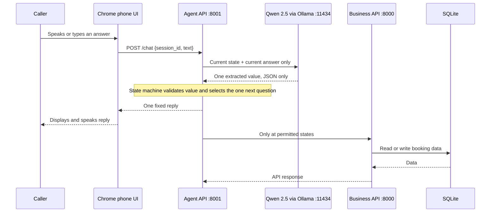
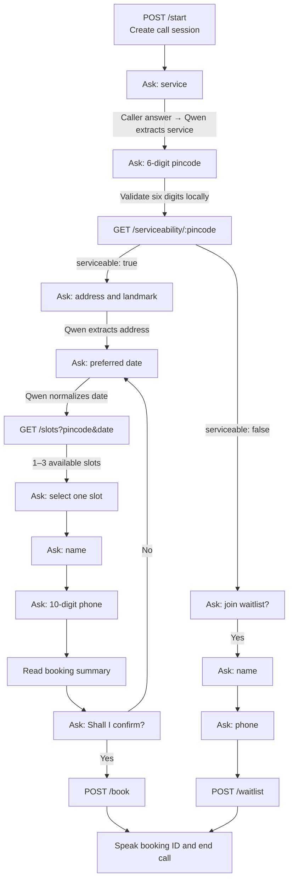

# ClearView: full conversation and API flow

## The important design rule

Qwen helps **interpret one answer**; it is not allowed to choose the next question, skip a state, or call an API. The FastAPI state machine owns those decisions. This is what prevents Charlie from asking for an address, date and slot in a single turn.

## Booking state map

## What happens at every state

| Current state | Caller provides | Qwen's narrow job | Local rule | Business API call | Charlie's next response |
|---|---|---|---|---|---|
| `service` | Home eye test or frame trial | Normalize service intent | Must match one of the two services | None | Ask for pincode |
| `pincode` | Six-digit pincode | None | Remove spaces; require exactly six digits | `GET /serviceability/{pincode}` | Ask for address if serviceable; otherwise offer waitlist |
| `address` | Flat/house and landmark | Extract address only | Minimum five characters | None | Ask for date |
| `date` | Today, tomorrow, weekday or ISO date | Normalize a natural date | Must resolve to `YYYY-MM-DD` | `GET /slots?pincode=&date=` | Offer only the returned slots |
| `slot` | One offered time or an availability concern | Semantically classify slot choice vs. needing another date | A selected time must equal a slot returned for this call | None | Ask for name, or return to date selection |
| `name` | Name | Extract name only | Cannot be only digits | None | Ask for phone |
| `phone` | Ten-digit phone | None | Require exactly ten digits | None | Read summary and ask for confirmation |
| `confirm` | Confirm, or an explicit correction | None | A correction rewinds only affected details | `POST /book` on confirm | Speak booking ID; or ask only the changed field |
| `waitlist_offer` | Yes or no | None | Explicit consent required | None | Ask for name or end call |
| `waitlist_phone` | Ten-digit phone | None | Require exactly ten digits | `POST /waitlist` | Confirm waitlist registration and end |

## APIs and stored data

| Endpoint | Called by | Trigger | Reads/writes |
|---|---|---|---|
| `POST /start` | Browser → agent | Caller presses Call | Creates in-memory call session; logs `call_started` |
| `POST /chat` | Browser → agent | Every caller answer | Sends only the current field to Qwen; validates and selects next state |
| `GET /api/serviceability/{pincode}` | Agent → business layer (also public) | Confirmed pincode | Reads `pincodes` table |
| `GET /api/slots?pincode=&date=` | Agent → business layer (also public) | Valid date after a serviceable pincode | Reads unbooked `slots` table; returns maximum three |
| `POST /api/book` | Agent → business layer (also public) | Caller says yes to final summary | Marks one slot booked; writes `bookings` row; returns `CV…` ID |
| `POST /api/waitlist` | Agent → business layer (also public) | Unsupported area plus explicit consent and phone | Writes `waitlist` row |
| `POST /api/event` | Agent → business layer (also public) | Major funnel milestone | Writes `call_events` row: started, pincode captured, serviceable, slots offered, booked or waitlisted |

## Technology responsibility map

| Technology | What it is responsible for | What it is *not* allowed to do |
|---|---|---|
| Chrome Speech Recognition | Voice to text | Advance a booking state |
| Browser Speech Synthesis | Speak Charlie's fixed reply | Create or modify booking data |
| Qwen 2.5 through Ollama | Extract the current field and semantically classify bounded intents, e.g. “my evening is packed” means another date | Decide unrestricted flow, invent an appointment field or call an API |
| FastAPI agent server | Hold session state, validate input, choose next fixed question, invoke permitted backend API | Trust an unvalidated model output |
| FastAPI business backend | Serviceability, slots, booking, waitlist and event endpoints | Manage conversation state |
| SQLite | Persist mock service areas, slots, bookings, waitlist and events | Talk directly to caller or model |
